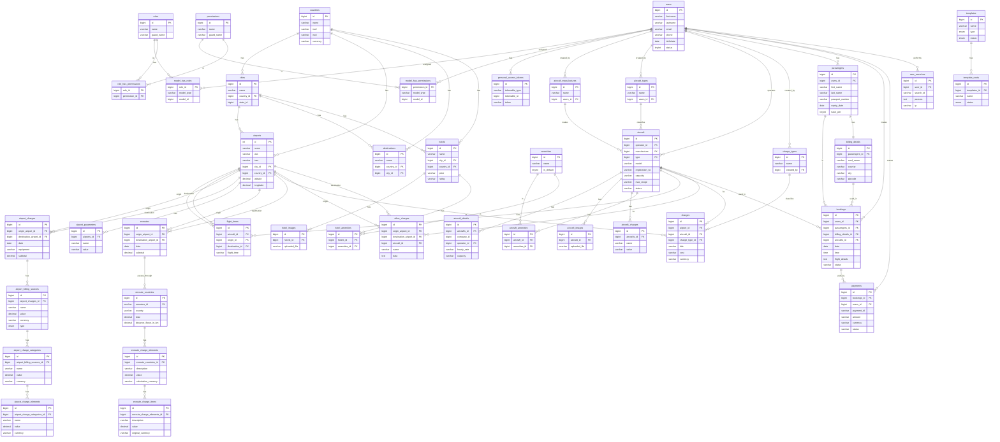

# LVoyage Database ER Diagram

```mermaid
erDiagram

    %% ── USERS & AUTH ──────────────────────────────────────────
    users {
        bigint id PK
        varchar firstname
        varchar lastname
        varchar email
        varchar phone
        date birthdate
        tinyint status
    }
    roles {
        bigint id PK
        varchar name
        varchar guard_name
    }
    permissions {
        bigint id PK
        varchar name
        varchar guard_name
    }
    model_has_roles {
        bigint role_id FK
        varchar model_type
        bigint model_id
    }
    model_has_permissions {
        bigint permission_id FK
        varchar model_type
        bigint model_id
    }
    role_has_permissions {
        bigint role_id FK
        bigint permission_id FK
    }
    personal_access_tokens {
        bigint id PK
        varchar tokenable_type
        bigint tokenable_id
        varchar token
    }

    users ||--o{ model_has_roles : "assigned"
    users ||--o{ model_has_permissions : "assigned"
    roles ||--o{ model_has_roles : "is"
    permissions ||--o{ model_has_permissions : "is"
    roles ||--o{ role_has_permissions : "has"
    permissions ||--o{ role_has_permissions : "in"
    users ||--o{ personal_access_tokens : "has"

    %% ── GEOGRAPHY ─────────────────────────────────────────────
    countries {
        bigint id PK
        varchar name
        varchar iso2
        varchar iso3
        varchar currency
    }
    cities {
        bigint id PK
        varchar name
        bigint country_id FK
        bigint state_id
    }
    airports {
        int id PK
        varchar name
        varchar iata
        varchar icao
        bigint city_id FK
        bigint country_id FK
        decimal latitude
        decimal longitude
    }
    destinations {
        bigint id PK
        varchar name
        bigint country_id FK
        bigint city_id FK
    }

    countries ||--o{ cities : "has"
    countries ||--o{ airports : "has"
    countries ||--o{ destinations : "has"
    cities ||--o{ airports : "has"
    cities ||--o{ destinations : "has"

    %% ── AIRCRAFT ──────────────────────────────────────────────
    aircraft_manufactures {
        bigint id PK
        varchar name
        bigint users_id FK
    }
    aircraft_types {
        bigint id PK
        varchar name
        bigint users_id FK
    }
    aircraft {
        bigint id PK
        bigint operator_id FK
        bigint manufacture FK
        bigint type FK
        varchar model
        varchar registration_no
        varchar capacity
        varchar max_range
        varchar status
    }
    aircraft_details {
        bigint id PK
        bigint aircrafts_id FK
        bigint company_id
        bigint operator_id FK
        varchar hourly_rate
        varchar capacity
    }
    aircraft_images {
        bigint id PK
        bigint aircraft_id FK
        varchar uploaded_file
    }
    aircraft_charges {
        bigint id PK
        bigint aircrafts_id FK
        varchar name
        varchar value
    }
    amenities {
        bigint id PK
        varchar name
        tinyint is_default
    }
    aircraft_amenities {
        bigint id PK
        bigint aircraft_id FK
        bigint amenities_id FK
    }

    users ||--o{ aircraft_manufactures : "created_by"
    users ||--o{ aircraft_types : "created_by"
    users ||--o{ aircraft : "operates"
    aircraft_manufactures ||--o{ aircraft : "makes"
    aircraft_types ||--o{ aircraft : "classifies"
    aircraft ||--o{ aircraft_details : "has"
    aircraft ||--o{ aircraft_images : "has"
    aircraft ||--o{ aircraft_charges : "has"
    aircraft ||--o{ aircraft_amenities : "has"
    amenities ||--o{ aircraft_amenities : "in"

    %% ── HOTELS ────────────────────────────────────────────────
    hotels {
        bigint id PK
        varchar name
        bigint city_id FK
        bigint country_id FK
        varchar price
        varchar rating
    }
    hotel_images {
        bigint id PK
        bigint hotels_id FK
        varchar uploaded_file
    }
    hotel_amenities {
        bigint id PK
        bigint hotels_id FK
        bigint amenities_id FK
    }

    cities ||--o{ hotels : "has"
    countries ||--o{ hotels : "has"
    hotels ||--o{ hotel_images : "has"
    hotels ||--o{ hotel_amenities : "has"
    amenities ||--o{ hotel_amenities : "in"

    %% ── FLIGHT TIMES ──────────────────────────────────────────
    flight_times {
        bigint id PK
        bigint aircraft_id FK
        bigint origin_id FK
        bigint destination_id FK
        varchar flight_time
    }

    aircraft ||--o{ flight_times : "flies"
    airports ||--o{ flight_times : "origin"
    airports ||--o{ flight_times : "destination"

    %% ── AIRPORT CHARGES ───────────────────────────────────────
    airport_charges {
        bigint id PK
        bigint origin_airport_id FK
        bigint destination_airport_id FK
        date date
        varchar equipment
        decimal subtotal
    }
    airport_billing_sources {
        bigint id PK
        bigint airport_charges_id FK
        varchar name
        decimal value
        varchar currency
        enum type
    }
    airport_charge_categories {
        bigint id PK
        bigint airport_billing_sources_id FK
        varchar name
        decimal value
        varchar currency
    }
    airport_charge_elements {
        bigint id PK
        bigint airport_charge_categories_id FK
        varchar name
        decimal value
        varchar currency
    }
    airport_parameters {
        bigint id PK
        bigint airports_id FK
        varchar name
        varchar value
    }

    airports ||--o{ airport_charges : "origin"
    airports ||--o{ airport_charges : "destination"
    airports ||--o{ airport_parameters : "has"
    airport_charges ||--o{ airport_billing_sources : "has"
    airport_billing_sources ||--o{ airport_charge_categories : "has"
    airport_charge_categories ||--o{ airport_charge_elements : "has"

    %% ── ENROUTE CHARGES ───────────────────────────────────────
    enroutes {
        bigint id PK
        bigint origin_airport_id FK
        bigint destination_airport_id FK
        date date
        decimal subtotal
    }
    enroute_countries {
        bigint id PK
        varchar enroutes_id FK
        varchar country
        decimal total
        decimal distance_flown_in_km
    }
    enroute_charge_elements {
        bigint id PK
        bigint enroute_countries_id FK
        varchar description
        decimal value
        varchar calculation_currency
    }
    enroute_charge_items {
        bigint id PK
        bigint enroute_charge_elements_id FK
        varchar description
        decimal value
        varchar original_currency
    }

    airports ||--o{ enroutes : "origin"
    airports ||--o{ enroutes : "destination"
    enroutes ||--o{ enroute_countries : "passes_through"
    enroute_countries ||--o{ enroute_charge_elements : "has"
    enroute_charge_elements ||--o{ enroute_charge_items : "has"

    %% ── GENERIC CHARGES ───────────────────────────────────────
    charge_types {
        bigint id PK
        varchar name
        bigint created_by FK
    }
    charges {
        bigint id PK
        bigint airport_id FK
        bigint aircraft_id FK
        bigint charge_type_id FK
        varchar title
        varchar cost
        varchar currency
    }
    other_charges {
        bigint id PK
        bigint origin_airport_id FK
        bigint destination_airport_id FK
        bigint aircraft_id FK
        varchar name
        text data
    }

    users ||--o{ charge_types : "created_by"
    charge_types ||--o{ charges : "classifies"
    airports ||--o{ charges : "at"
    aircraft ||--o{ charges : "for"
    airports ||--o{ other_charges : "origin"
    airports ||--o{ other_charges : "destination"
    aircraft ||--o{ other_charges : "for"

    %% ── BOOKING FLOW ──────────────────────────────────────────
    passengers {
        bigint id PK
        bigint users_id FK
        varchar first_name
        varchar last_name
        varchar passport_number
        date expiry_date
        tinyint have_pet
    }
    billing_details {
        bigint id PK
        bigint passengers_id FK
        varchar card_name
        varchar country
        varchar city
        varchar zipcode
    }
    bookings {
        bigint id PK
        bigint users_id FK
        bigint passengers_id FK
        bigint billing_details_id FK
        bigint aircrafts_id FK
        date date
        time time
        text flight_details
        varchar status
    }
    payments {
        bigint id PK
        bigint bookings_id FK
        bigint users_id FK
        varchar payment_id
        varchar amount
        varchar currency
        varchar status
    }
    user_searches {
        bigint id PK
        bigint user_id FK
        varchar search_id
        text params
        varchar ip
    }

    users ||--o{ passengers : "has"
    users ||--o{ bookings : "makes"
    users ||--o{ payments : "makes"
    users ||--o{ user_searches : "performs"
    passengers ||--o{ bookings : "in"
    passengers ||--|| billing_details : "has"
    billing_details ||--o{ bookings : "used_in"
    aircraft ||--o{ bookings : "used_in"
    bookings ||--o{ payments : "paid_by"

    %% ── TEMPLATES ─────────────────────────────────────────────
    templates {
        bigint id PK
        varchar name
        enum type
        enum status
    }
    template_costs {
        bigint id PK
        bigint templates_id FK
        varchar name
        enum status
    }

    templates ||--o{ template_costs : "has"
```
